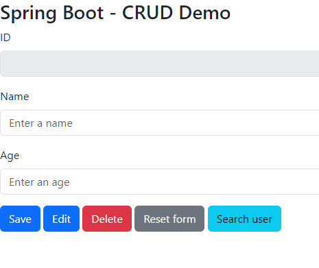
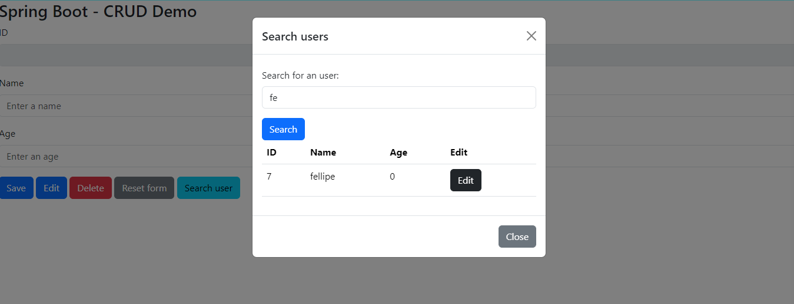

## About the project
This is a demo project for study purposes. It consists of a simple fullstack CRUD project comprising a Java web service as backend plus a Bootstrap frontend built with Spring Boot, Apache TomCat and PostgresSQL as database.

## About the architecture
- Backend: the web service
  - Java with Spring Boot framework (version: 3.2.10-SNAPSHOT);
    - Java version: 17.
- Frontend:
  - Bootstrap (version: 5.3.3) with CDN;
  - Jquery (version: 3.7.1) with CDN.
- Database:
  - Postgres 17 (the version will be always the last thanks to "latest" tag defined in the `docker-compose.yaml` file).
- Pattern used: a simplified Layered Architecture (see the logical layers below)
  - The REST Controller class is the `UserResource.java` file, which is our Resource Layer, being responsible to control the resources pertaining to the Postgres Table `tb_users`, i.e. receiving the requests from the frontend and responding according to the expected system behaviors.
  - For simplification, I chose to not use a Service layer, so as I could cumulate the few existant business rules all within the Resource Layer, even being aware it is not a good practice.
  - The "Data access layer" is the interface `UserRepository.java`, which extends the JPA Repository class.
    - It's the sole logical layer interacting with the entity `User`, which is the file `User.java`, containg the core objects used throughout the application.

## The rationale

## How to use
### About the Postgres database
No need to install a Postgres on your local machine. Simply use the provided docker-compose.yaml file. Change the database properties, volume, port and other settings as per your needs and run `docker-compose up -d` to start the database.

Using a database admin, such as Dbeaver (like I did) you can connect to the database pointing to the database port (using user and password etc.) as you set in the `docker-compose.yaml` file.

## Running the project
Execute the DemoApplication.java or the Spring boot project on your favorite IDE and go to http://localhost:8081/crudproject/ to see the demo.

## The project at a glance

- Empty state
  - 
- Search modal open with findAll() method invoked
  - 
- Search modal open with findByName() method invoked
  - 
- Exception treatment for deleting operation
  - 
- The Postgres table data being shown using DBeaver
  -   